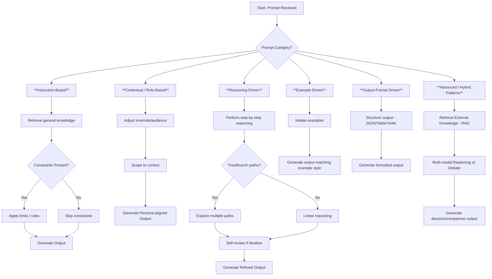

## ✅ Categorization of Prompt Patterns

---

### 📂 **Category 1: Instruction-Based Patterns**
👉 *Focus is on clear task instructions — direct or detailed*

| Pattern                            | Description                              | Use Cases / Strength                       | Model Perspective |
|------------------------------------|------------------------------------------|--------------------------------------------|-------------------|
| **Instruction-Only**               | Plain task command without extra context | Fast, general tasks with clear goals       | Model predicts output directly using general knowledge |
| **Context + Instruction-Only**     | Task with context, no examples           | Rule-driven tasks, fast execution          | Model uses context for grounding, but still direct generation |
| **Constraint Prompting**           | Adds word/logic/format limits            | Enforce strict length or logic constraints | Model monitors token limits and follows explicit constraints |
| **Prohibition/Negative Prompting** | Explicitly sets what NOT to do           | Controls scope, prevents hallucination     | Model avoids generating prohibited content based on instruction |

---

### 📂 **Category 2: Contextual & Role-Driven Patterns**
👉 *Add persona, context, or background to influence the model's output*

| Pattern                           | Description                              | Use Cases / Strength                                                       | Model Perspective |
|-----------------------------------|------------------------------------------|----------------------------------------------------------------------------|-------------------|
| **Role Prompting**                | Tells the model WHO it is                | Improves domain-specific reasoning and tone                                | Model adapts tone, style, and domain reasoning to the role |
| **Audience Targeting**            | Tells the model WHO the output is for    | Aligns output style and complexity to the intended audience                | Model adjusts detail level and tone based on audience needs |
| **Delimiter / Boundary Setting**  | Explicit context boundaries              | Prevents knowledge bleed, enables scoped generation                        | Model restricts reasoning only to the bounded context |
| **Reframing / Multi-Perspective** | Covers positive/negative or multi-angle  | Critical thinking, ensures balanced test coverage                          | Model generates multiple perspectives, switching viewpoints |
| **Comparative / Hypothetical**    | Asks for comparison or what-if scenarios | Critical thinking, enables trade-off analysis, impact analysis             | Model reasons across multiple scenarios or hypothetical outcomes |

---

### 📂 **Category 3: Reasoning-Driven Patterns (Cognitive Control)**
👉 *Patterns that push the model to reason, think, or refine output*

| Pattern                             | Description                           | Use Cases / Strength                                         | Model Perspective |
|-------------------------------------|---------------------------------------|---------------------------------------------------------------|-------------------|
| **Chain of Thought (CoT)**          | Step-by-step reasoning                | Enhances reasoning depth, prevents shallow answers             | Model generates reasoning steps sequentially, each depending on the last |
| **Tree of Thought (ToT)**           | Multi-path reasoning trees            | Explores multiple reasoning paths for completeness             | Model spawns parallel reasoning branches and compares paths |
| **Iterative / Reflective Prompting**| Self-review and improvement           | Encourages self-correction and coverage improvement            | Model reflects on its own output and refines answers iteratively |

---

### 📂 **Category 4: Example-Driven Patterns**
👉 *Guide the model with examples or demonstrations*

| Pattern                               | Description                                | Use Cases / Strength                                        | Model Perspective |
|---------------------------------------|--------------------------------------------|--------------------------------------------------------------|-------------------|
| **Few-Shot Prompting**                | Provide examples, ask for similar output   | Controls output style/format, ensures consistency            | Model copies the demonstrated style and structure from examples |
| **Zero-Shot Prompting**               | Direct task without examples               | Quick high-level generation, exploratory tasks                | Model infers structure purely from task instruction and training data |
| **Multiple Choice / Option Prompting**| Provide options to pick from               | Good for closed set validation or decision-making             | Model evaluates provided options and selects the most likely one |

---

### 📂 **Category 5: Output-Format Driven Patterns**
👉 *Explicitly control the format of the LLM output*

| Pattern                       | Description                                     | Use Cases / Strength                                         | Model Perspective |
|------------------------------|-------------------------------------------------|---------------------------------------------------------------|-------------------|
| **Output Format Prompting**  | Specifies output as JSON, Tables, XML, YAML etc.| For test case tables, JSON output, API payloads               | Model structures output to match the requested format |
| **Skeleton/Template Prompting** | Provides a blank structure for filling        | Standardizes output into reusable skeletons                   | Model fills the template exactly as instructed |
| **Table Format Prompting**   | Instructs the model to output a structured table| Perfect for test documentation and readable outputs           | Model formats the output as a clean, readable table |

---

### 📂 **Category 6: Advanced / Hybrid Patterns**
👉 *Combine reasoning, structure, and control — used in complex workflows*

| Pattern                          | Description                                  | Use Cases / Strength                                         | Model Perspective |
|----------------------------------|----------------------------------------------|---------------------------------------------------------------|-------------------|
| **Retrieval-Augmented (RAG)**    | External knowledge injection                 | Best for spec-driven test case generation, RAG pipelines      | Model conditions generation strictly on retrieved knowledge |
| **Multi-modal Prompting**        | Combine text, images, audio                   | Useful for UI test cases, image-based flows                   | Model processes multiple modalities, integrating vision/audio into reasoning |
| **Debate / Self-Critique / Agent Prompting** | Force pros/cons or debates         | Great for risk-based reasoning, coverage expansion            | Model generates both sides of reasoning and critiques itself or generates agent-like debates |

## ✅ What happens inside the Model?

